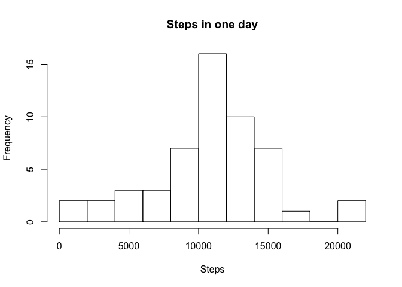
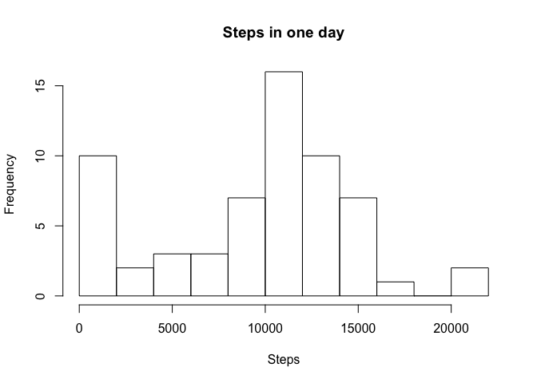

Loading and preprocessing the data
----------------------------------

    library(dplyr)

    ## 
    ## Attaching package: 'dplyr'

    ## The following objects are masked from 'package:stats':
    ## 
    ##     filter, lag

    ## The following objects are masked from 'package:base':
    ## 
    ##     intersect, setdiff, setequal, union

    con <- unz("activity.zip", "activity.csv")
    open(con)
    data <- read.csv(con)
    close(con)

    summary(data)

    ##      steps                date          interval     
    ##  Min.   :  0.00   2012-10-01:  288   Min.   :   0.0  
    ##  1st Qu.:  0.00   2012-10-02:  288   1st Qu.: 588.8  
    ##  Median :  0.00   2012-10-03:  288   Median :1177.5  
    ##  Mean   : 37.38   2012-10-04:  288   Mean   :1177.5  
    ##  3rd Qu.: 12.00   2012-10-05:  288   3rd Qu.:1766.2  
    ##  Max.   :806.00   2012-10-06:  288   Max.   :2355.0  
    ##  NA's   :2304     (Other)   :15840

What is mean total number of steps taken per day?
-------------------------------------------------

    sums <- aggregate(data$steps, list(data$date), sum)
    names(sums) <- list("date", "steps")

1.  Make a histogram of the total number of steps taken each day

<!-- -->

    hist(sums$steps, breaks = 10, main = "Steps in one day")

1.  Calculate and report the mean and median total number of steps taken
    per day

*Mean* steps taken per day:

    mean.steps1 <- mean(sums$steps, na.rm = TRUE)
    mean.steps1

    ## [1] 10766.19

*Median* steps:

    median.steps1 <-median(sums$steps, na.rm = TRUE)
    median.steps1

    ## [1] 10765

What is the average daily activity pattern?
-------------------------------------------

1.  Make a time series plot (i.e. type = "l") of the 5-minute
    interval (x-axis) and the average number of steps taken, averaged
    across all days (y-axis)

<!-- -->

    data2 <- data %>%
      mutate(steps = ifelse(is.na(steps), 0, steps)) %>%
      group_by(interval) %>%
      summarise(mean.steps = mean(steps))
      
    plot(data2$interval, data2$mean.steps, type = "l", xlab = "Interval", ylab = "Steps", main = "Average number of steps")

1.  Which 5-minute interval, on average across all the days in the
    dataset, contains the maximum number of steps?

<!-- -->

    max.item = data2[which(data2$mean.steps == max(data2$mean.steps)),]
    max.item$interval

    ## [1] 835

Imputing missing values
-----------------------

1.  Calculate and report the total number of missing values in the
    dataset (i.e. the total number of rows with NAs)

<!-- -->

     length(which(is.na(data$steps)))

    ## [1] 2304

1.  Devise a strategy for filling in all of the missing values in
    the dataset. The strategy does not need to be sophisticated. For
    example, you could use the mean/median for that day, or the mean for
    that 5-minute interval, etc.

    *I think the selection of a reasonable strategy depends on
    the objective. Here I suggest to set missing value to 0.*

2.  Create a new dataset that is equal to the original dataset but with
    the missing data filled in.

<!-- -->

    data3 <- mutate(data, steps = ifelse(is.na(steps), 0, steps))

1.  Make a histogram of the total number of steps taken each day and
    Calculate and report the mean and median total number of steps taken
    per day. Do these values differ from the estimates from the first
    part of the assignment? What is the impact of imputing missing data
    on the estimates of the total daily number of steps?

<!-- -->

    sums2 <- aggregate(data3$steps, list(data3$date), sum)
    names(sums2) <- list("date", "steps")
    hist(sums2$steps, breaks = 10, main = "Steps in one day")

Steps of each day:

    day.steps2 <- aggregate(data3$steps, list(data$date), sum)

Mean steps of days:

    mean.steps2 <- mean(day.steps2$x)
    mean.steps2

    ## [1] 9354.23

Median steps of days:

    median.steps2 <- median(day.steps2$x)
    median.steps2

    ## [1] 10395

    mean.delta <- mean.steps2 - mean.steps1
    median.delta <- median.steps2 - median.steps1

*mean* diff: -1411.959171, *median* diff: -370. So they are *different*.

Are there differences in activity patterns between weekdays and weekends?
-------------------------------------------------------------------------

1.  Create a new factor variable in the dataset with two levels –
    “weekday” and “weekend” indicating whether a given date is a weekday
    or weekend day.

<!-- -->

    data4 <- mutate(data3, 
                    day = ifelse(weekdays(as.Date(data3$date), abbreviate=TRUE) %in% c('Sat', 'Sun'),
                                     "weekend", "weekday"))

1.  Make a panel plot containing a time series plot (i.e. type = "l") of
    the 5-minute interval (x-axis) and the average number of steps
    taken, averaged across all weekday days or weekend days (y-axis).

<!-- -->

    library(lattice)
    weekday.mean.steps <- aggregate(data4$steps, list(data4$interval, data4$day), mean)
    names(weekday.mean.steps) <- c("interval", "day", "steps")

    xyplot(steps ~ interval | day, data = weekday.mean.steps, 
           xlab = "Number of steps", ylab = "Interval",
           type = 'l', layout = c(1,2))

